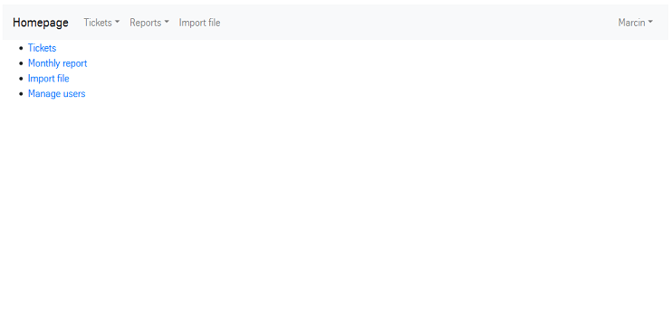
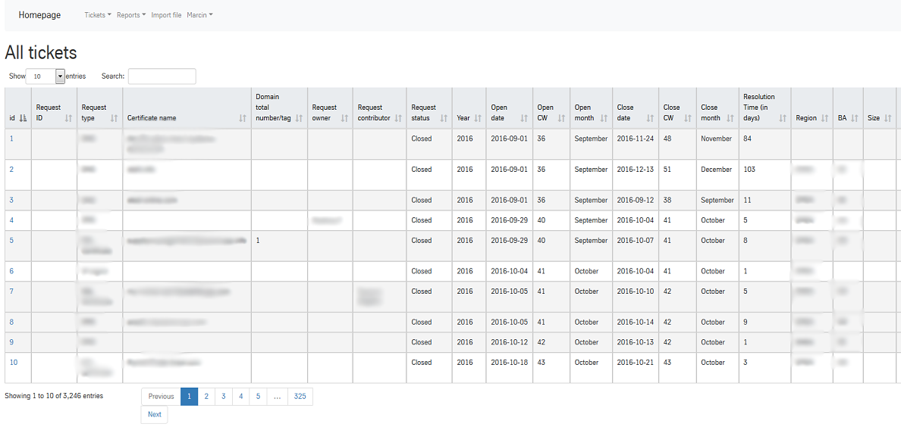
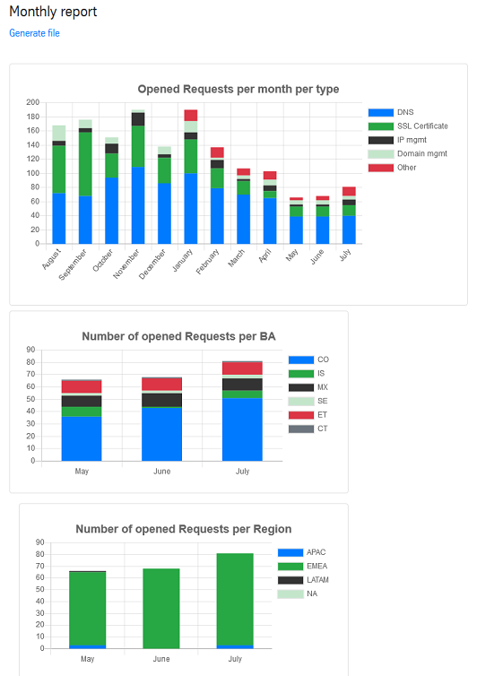
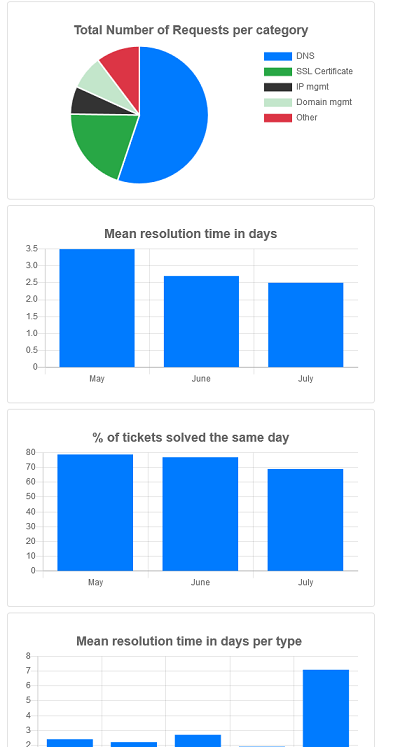
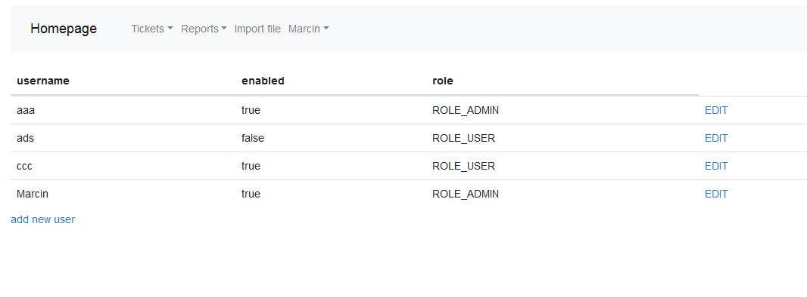

# raportTool

### Opis programu
Narzędzie do tworzenia raportów. Na podstawie danych w bazie MySQL tworzone są statystyki zrealizowanych zgłoszeń (ticketów).

Możliwość importu oraz edycji danych w bazie danych MySQL. 

Tworzenie wykresów i export danych do Excela

Dodawanie i edytowanie użytkowników, grup użytkowników, na podstawie których są nadawane uprawnienia.

### Zastosowane technologie: 
Spring, Spring Boot, Spring Security, Hibernate, JSP, JDBC, Java Script, Apache POI
